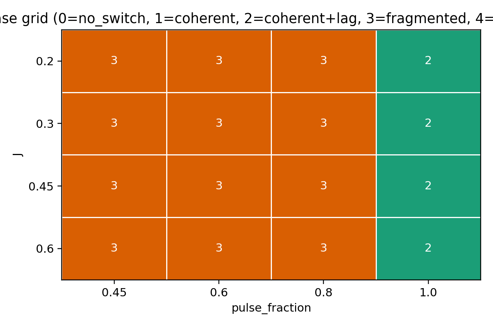
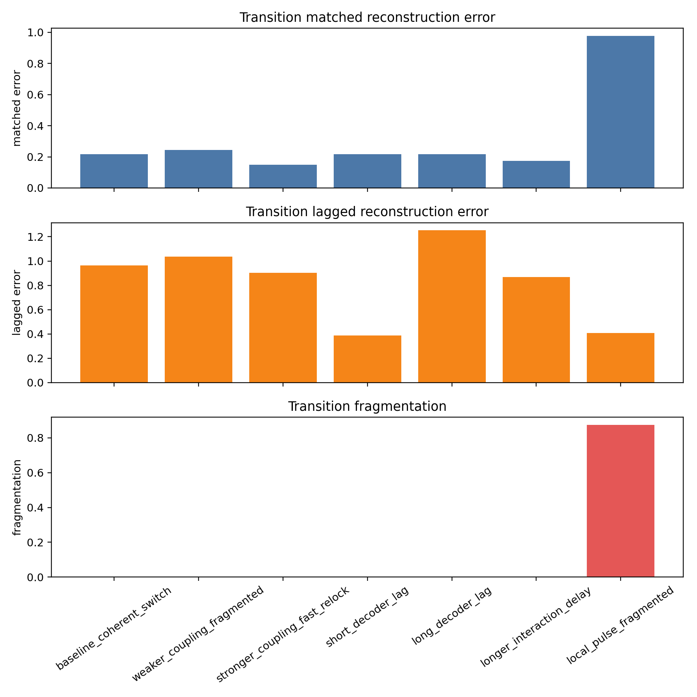
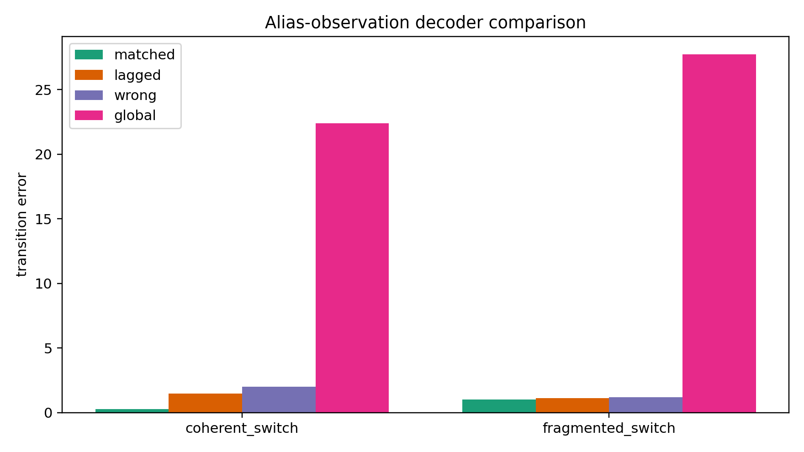
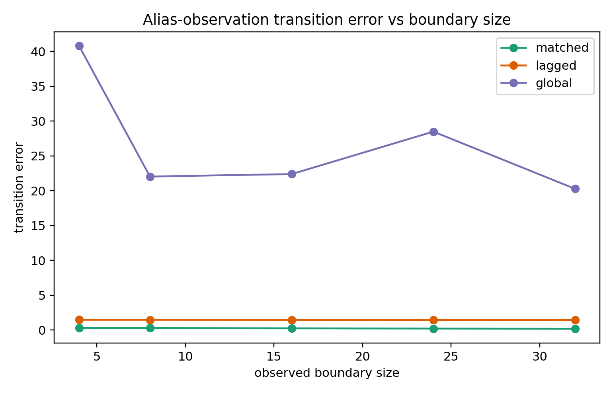
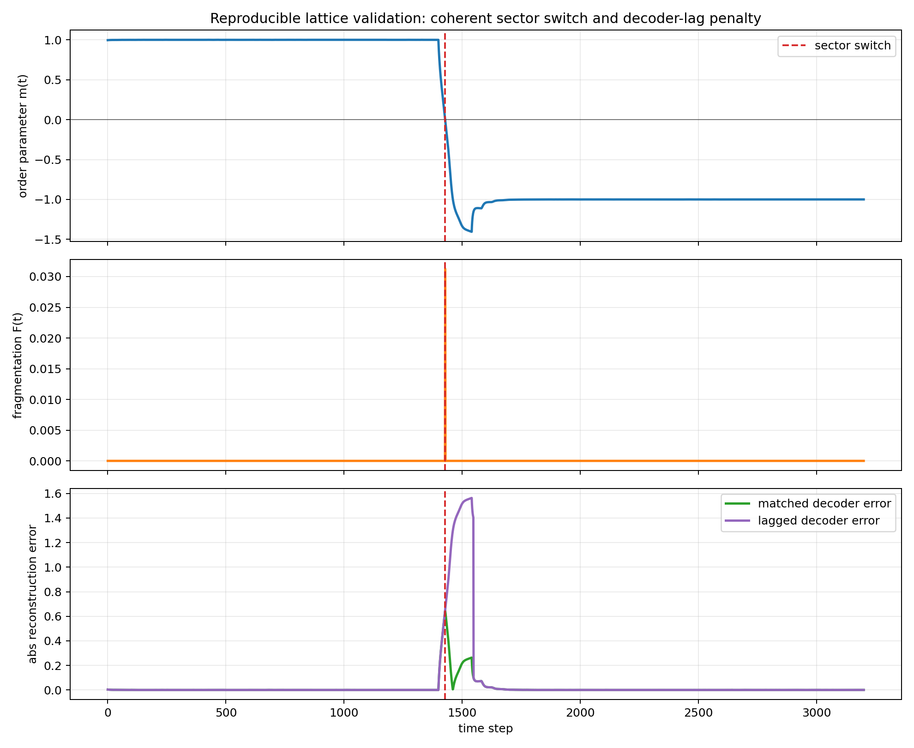

# Beyond the Grinberg Lattice: Boundary Precision, Sector Switching, and Decoder Lag in a Holographic-QEC-Inspired Model of Coherence and Recoverability

**Author:** Alberto Cardenas  
**Correspondence:** iam@albertocardenas.com  
**Date:** 2026-03-26  
**Document type:** Final paper-style manuscript  
**Evidence basis:** Source audit + reproduced local simulations  
**Keywords:** lattice dynamics; metastability; recoverability; decoder lag; partial observation; Jacobo Grinberg

## Abstract
Jacobo Grinberg's lattice-like research program remains scientifically unresolved: historically influential, conceptually ambitious, and mathematically incomplete. This paper revisits that program using contemporary tools from holographic quantum error correction (HQEC), entanglement-wedge reconstruction, metastable neural dynamics, and nonlinear systems theory. The objective is not to preserve Grinberg's original terminology, but to determine whether a defensible scientific core can be extracted from it and reformulated into a reproducible research program.

The source audit produces a sharp negative result and a narrower constructive result. Negative: the most speculative terms often associated with retrospective interpretations of Grinberg's work are not standard technical objects in HQEC, mainstream neuroscience, or chaos theory, and therefore cannot be treated as literature-native constructs. Constructive: the strongest admissible bridge runs through **recoverability and code-subspace dependence** in HQEC, **metastable integration/segregation and phase-locking** in neural dynamics, and **delay-driven regime switching** in nonlinear systems.

On that basis, we study a delayed bistable lattice with sector-conditioned decoding. The reproduced simulations separate two robust regimes: **coherent sector switching with transient decoder-lag penalty** and **fragmented local transition with persistent recovery degradation**. Under sign-aliased boundary observations, sector-conditioned decoding becomes necessary, providing a simple but reproducible analogue of restricted recoverability across effective code families. The main conclusion is therefore limited but substantive: if a lattice-like medium supports metastable coherent sectors and partial-observation decoding, then transient temporal mismatch can be modeled as delayed decoder updating across a sector transition, while fragmentation corresponds to a distinct dynamical failure mode. This does not validate Grinberg's ontology directly. It does identify a technically disciplined continuation of the surviving core of his lattice program that is consistent with current sources and reproduced simulations.

## 1. Introduction
Jacobo Grinberg proposed a lattice-like and field-like account of consciousness intended to connect neural organization, coherence, and the structure of experience.[1][2][3][4][5] That program was unusual in scope and historically difficult to evaluate because its strongest intuitions were not matched by a correspondingly mature mathematical formalism. Thirty-two years after his disappearance, it is now possible to revisit some of those intuitions using a scientific vocabulary unavailable to him: holographic recoverability, operator-algebraic error correction, metastability, attractor theory, delay-coupled synchronization, and lattice/field models of neural dynamics.[6][7][8][9][10][11][12][13][14][15][16][17][18][19]

This paper addresses a deliberately narrow question:

> **Can a source-backed and simulation-backed scientific core be extracted from Grinberg's lattice intuition without relying on speculative vocabulary or unsupported ontology?**

The answer developed here is yes, but only after substantial reframing. The scientifically productive version of the problem is not whether extraordinary phenomena can be mapped onto modern theories. It is whether the following motifs can be linked in a disciplined way:
- boundary-dependent recoverability,
- sector-conditioned decoding,
- metastable coherence versus fragmentation,
- and delay-induced mismatch during regime transitions.

The paper has four aims:
1. identify which parts of the original conceptual field can be retained under modern scientific standards,
2. separate source-native constructs from retrospective overinterpretation,
3. formulate a minimal model that implements the admissible bridge,
4. test whether that model yields reproducible distinctions between coherent switching and fragmentation.

The result is a paper about **coherence and recoverability**, not about extraordinary claims. Its strongest contribution is to clarify how one may continue Grinberg's program scientifically while also drawing a hard boundary around what cannot presently be defended.

The paper's concrete contributions are fourfold:
1. a source-audited translation of Grinberg's surviving lattice intuition into modern technical language,
2. a minimal delayed-lattice model that operationalizes sector switching, fragmentation, and decoder lag,
3. reproduced simulations showing a stable separation between coherent switching and fragmented transitions,
4. an explicit computational reproducibility package with machine-readable outputs intended for external inspection.

## 2. Epistemic framework
The paper follows three methodological rules.

### 2.1 Source-native claims remain source-native
If a term is not standard in the cited literature, it is not introduced as if it were. This is essential in cross-domain work, where technical laundering of speculative language is an ever-present risk.

### 2.2 Structural analogy is not ontological identity
Two frameworks may share mathematical structure without sharing ontology. For example, an effective sector in a dynamical lattice may be analogous to a restricted code family in HQEC without being literally the same physical object.

### 2.3 Simulations constrain mechanism, not ontology
The model studied here is a toy model. Its value lies in clarifying mechanism, discriminating regimes, and generating testable predictions. It does not establish a biological substrate by itself.

## 3. Related work
### 3.1 Grinberg as historical antecedent
The primary and near-primary Grinberg materials available here describe a syntergic or lattice-like conceptual framework centered on distributed neural fields, coherence, and reality-construction.[1][2][3][4][5] These works remain relevant because they pose a large-scale question about whether conscious organization should be understood as a distributed field process rather than as localized signal passing alone. They do not provide a modern theory of recoverability, decoder structure, or state-dependent reconstruction comparable to present-day HQEC or dynamical-systems formalism.

In this paper, Grinberg is therefore treated neither as a solved precursor nor as a figure to be defended symbolically. He is treated as an antecedent whose strongest intuitions may survive technical reformulation.

### 3.2 HQEC and entanglement-wedge reconstruction
The sharpest mathematical language for recoverability comes from HQEC and entanglement-wedge reconstruction.[6][7][8][9][10][11][12][13][14][33] In this literature, reconstruction depends on a code subspace, a boundary region, an operator algebra, and a recovery map.

Three aspects matter especially here.

**Conditional reconstructability.** Not every bulk operator is reconstructable from every boundary region.[6][10][11]  
**Approximate recovery and code-family restriction.** Alpha-bits and universal recovery make it explicit that valid decoding may depend on restricting the effective state family.[8][9][12][13][14]  
**Complexity barriers.** In-principle recoverability and practical decodability are not the same.[9][13][14]

These points make HQEC valuable here not as a theory of brains, but as a disciplined source of concepts for conditional recovery under partial access.

### 3.3 Modern lattice and field approaches in neuroscience
A scientifically meaningful use of the word *lattice* cannot rely on Grinberg alone. Recent work by Bardella and collaborators shows that neural systems can be studied with explicit lattice-field language and statistical-field methods.[15][16] These works do not validate Grinberg's ontology. They do demonstrate that lattice-like organization can be discussed within a contemporary mathematical framework rather than as metaphor alone.

### 3.4 Metastability and attractor structure
The most rigorous language for coherence versus fragmentation comes from metastability and attractor theory.[17][18][19][20][30][31][32] Neural activity often consists of long-lived but transient regimes associated with almost-invariant regions of state space.[17] Attractor and integrator models provide robust low-dimensional sectors, denoising, and persistence.[19] The “metastable brain” framework highlights flexible integration and segregation as central organizational motifs rather than fixed synchrony.[18]

These sources justify the paper's key translation:
- coherent global order -> metastable sector with high internal consistency,
- fragmented transition -> loss of integration or competition among local domains.

### 3.5 Delay, synchronization, and sensitive dependence
The nonlinear-dynamics literature supports abrupt regime changes under coupling and delay, but does not support collapsing sensitive dependence into phase-locking.[21][22][23][24][25][26] Sensitive dependence concerns trajectory divergence; phase-locking concerns coordinated phase relations. What is source-backed is weaker and sufficient: nonlinear systems can jointly exhibit perturbation sensitivity, delay-dependent synchronization structure, metastability, and abrupt regime switching.[21][22][23][24][25][26]

### 3.6 Precision and boundary control
If one seeks a modern scientific replacement for Grinberg's more suggestive but informal control language, the nearest formal family lies partly in active inference and the free-energy framework, where **precision weighting** and confidence assignment modulate how evidence shapes internal states.[27][28][29] This does not merge active inference and HQEC. It does motivate the use of **boundary precision** or **decoder confidence** as scientific language for controllable recoverability.

## 4. Problem reformulation
The motivating problem is therefore reformulated as follows:

> **Can a lattice-like dynamical medium with delayed coupling support coherent sector switching, fragmented local transitions, and boundary-dependent decoding in a way that usefully parallels restricted recoverability in HQEC?**

This formulation retains the scientifically viable core of the original lattice intuition while removing unsupported conceptual burden.

## 5. Model and methods
### 5.1 Design constraints
The model is designed to satisfy three constraints drawn from the literature:
1. it must support more than one coherent sector,
2. partial observation must not always suffice for sector-agnostic decoding,
3. delay must generate a transient mismatch regime without invoking nonphysical temporal claims.

### 5.2 Delayed bistable lattice
We study a one-dimensional periodic lattice with local scalar state $x_i(t)$ governed by

$$
\frac{d x_i}{dt} = \alpha x_i - \beta x_i^3 + J\big(x_{i-1}(t-\tau_d) + x_{i+1}(t-\tau_d) - 2x_i(t)\big) + u_i(t) + \sigma \eta_i(t).
$$

Parameters:
- $\alpha,\beta>0$: local bistability,
- $J>0$: local coupling,
- $\tau_d$: interaction delay,
- $u_i(t)$: pulse or forcing,
- $\sigma\eta_i(t)$: noise.

The characteristic local magnitude is

$$
x_* = \sqrt{\alpha/\beta}.
$$

### 5.3 Macroscopic and boundary observables
We define the bulk-like order parameter

$$
m(t)=\frac{1}{N}\sum_{i=1}^N x_i(t),
$$

a boundary-like observation over a subset $A$,

$$
b(t)=\frac{1}{|A|}\sum_{i\in A} x_i(t),
$$

and a sector label

$$
s(t)=\operatorname{sign}(m(t))\in\{+1,-1\}.
$$

### 5.4 Coherence and fragmentation metrics
We quantify order through

$$
C(t)=\left|\frac{1}{N}\sum_{i=1}^N \operatorname{sign}(x_i(t))\right|, \qquad F(t)=1-C(t).
$$

High $C$ indicates near-global order. High $F$ indicates fragmentation.

### 5.5 Sector-conditioned decoder
We define a decoder conditioned on a sector label,

$$
D_s(b)=s x_* + \lambda\big(b-sx_*\big), \qquad 0<\lambda<1.
$$

The three evaluated decoders are:
- matched decoder: $\hat m_{\mathrm{matched}}(t)=D_{s(t)}(b(t))$,
- wrong decoder: $\hat m_{\mathrm{wrong}}(t)=D_{-s(t)}(b(t))$,
- lagged decoder: $\hat m_\Delta(t)=D_{s(t-\Delta)}(b(t))$.

Errors are measured against the latent order parameter $m(t)$.

### 5.6 Operational decoder-lag variable
We define

$$
\mathrm{TS}_\Delta(t)=\mathbf{1}[s(t-\Delta)\neq s(t)],
$$

which marks the interval in which the decoder still applies an outdated sector label. This is the paper's operational replacement for temporal mis-indexing.

### 5.7 Verification protocol
To ground the manuscript in fresh evidence, the following scripts were rerun in the supporting experiment suite:
- `python3 experiments/faith_boundary_hqec_toy_model.py`
- `python3 experiments/faith_boundary_hqec_sweep.py`
- `python3 experiments/faith_boundary_hqec_phase_grid.py`
- `python3 experiments/faith_boundary_hqec_alias_decoder_study.py`
- `python3 experiments/faith_boundary_hqec_alias_observed_sweep.py`
- `python3 experiments/faith_boundary_hqec_extended_validation.py`

The model was evaluated against four minimal oracles:
1. coherent-sector recoverability,
2. pulse-induced sector switching,
3. lagged-decoder penalty,
4. fragmented-switch separation.

### 5.8 Reproducibility package for independent inspection
To make the core claim easier for other researchers to inspect, a companion reproducibility package accompanies the manuscript. The package separates model definition, metric calculation, parameter sweeps, seed-level statistics, and plotting into distinct scripts:
- `lattice_core.py`
- `calc_single_case.py`
- `calc_phase_grid.py`
- `calc_alias_decoder.py`
- `calc_boundary_size_sweep.py`
- `calc_seed_statistics.py`
- `plot_lattice_validation.py`

Machine-readable outputs are written as CSV and JSON files under `repro_outputs/`. This package is not a new theory layer; it is an independent, paper-aligned implementation intended to let other researchers verify the reported quantities with minimal notebook translation effort.

## 6. Results
### 6.1 Baseline coherent switch
The baseline rerun yielded:
- `switch_step = 1428`
- `pre_sector = +1`, `post_sector = -1`
- `transition_fragmentation = 0.0010416667`
- `transition_matched_error = 0.2176099563`
- `transition_lag_error = 0.9642067699`
- `mismatch_count = 120`

The system therefore executes a coherent global sector switch with negligible fragmentation, while lagged decoding incurs a large transient penalty.

### 6.2 Curated sweep
The curated sweep cleanly separates two families.

#### Coherent-switch family
Representative cases include the baseline, stronger coupling, longer lag, and longer interaction delay. Across this family:
- fragmentation remains near zero,
- matched recovery remains good before and after the transition,
- lagged decoding worsens sharply when sector updating is delayed.

#### Fragmented-switch family
For `local_pulse_fragmented`, the rerun produced:
- `transition_fragmentation = 0.875`
- `transition_matched_error = 0.9779404538`
- `transition_lag_error = 0.4059508357`
- `post_matched_error = 0.4759942121`

This is the critical contrast condition: degradation is no longer explained by delayed sector assignment alone. The lattice itself has lost coordinated global structure.

### 6.3 Sector dependence under sign-aliased observation
Direct boundary means can make decoding too easy in coherent regimes. To remove this trivialization, we introduced sign aliasing:

$$
z(t)=|b(t)|.
$$

In the coherent-switch case, the rerun yielded:
- transition matched error: `0.254925`
- transition lagged error: `1.468448`
- transition wrong error: `1.992986`
- transition global error: `22.396115`

This is one of the manuscript's strongest results. Once the observation stops directly revealing sector sign, **sector-conditioned decoding becomes necessary**.

### 6.4 Boundary-size dependence under sign aliasing
The alias-observation sweep gave:

| Observed sites | Transition matched | Transition lagged | Transition global |
|---|---:|---:|---:|
| 4  | 0.307069 | 1.479577 | 40.791850 |
| 8  | 0.294489 | 1.476914 | 22.042286 |
| 16 | 0.254925 | 1.468448 | 22.396115 |
| 24 | 0.216712 | 1.462087 | 28.493550 |
| 32 | 0.178828 | 1.454637 | 20.281568 |

Increasing boundary size improves matched reconstruction, but does not rescue the lagged decoder.

### 6.5 Coarse phase grid
The reproduced phase grid was:

| $J$ \\ pulse fraction | 0.45 | 0.60 | 0.80 | 1.00 |
|---|---|---|---|---|
| 0.20 | fragmented | fragmented | fragmented | coherent + lag |
| 0.30 | fragmented | fragmented | fragmented | coherent + lag |
| 0.45 | fragmented | fragmented | fragmented | coherent + lag |
| 0.60 | fragmented | fragmented | fragmented | coherent + lag |

Across this tested range, pulse geometry is the dominant control on phase identity: partial forcing produces fragmented transitions, while global forcing produces coherent sector switches.

### 6.6 Extended validation
The extended validation rerun produced:
- `fragmented_switch = 972`
- `coherent_switch = 108`
- `coherent_switch_with_decoder_lag = 216`

Stratified by pulse fraction:
- `0.45` -> all fragmented, mean fragmentation `0.885986`
- `0.60` -> all fragmented, mean fragmentation `0.779437`
- `0.80` -> all fragmented, mean fragmentation `0.371836`
- `1.00` -> all coherent, mean fragmentation `0.000342`

This supports a two-level interpretation:
1. forcing geometry determines coherent versus fragmented transition type,
2. decoder lag controls anomaly strength within coherent-switch regimes.

### 6.7 Independent reimplementation and robustness checks
The companion reproducibility package produced closely matching results under an independent implementation of the same delayed-lattice mechanism.

For the baseline single-case rerun (`calc_single_case.py`), the package yielded:
- `switch_step = 1428`
- `transition_fragmentation = 0.0001736111`
- `transition_matched_error = 0.2176573809`
- `transition_lag_error = 0.9642739522`
- `post_matched_error = 0.0043506445`
- `mismatch_count = 120`

These values are numerically close to the main experiment-suite results and support the same interpretation: coherent switching remains low-fragmentation, while lagged decoding remains substantially worse than matched decoding during the transition.

To reduce dependence on a single random seed, `calc_seed_statistics.py` summarized 30 seeds for two anchor conditions.

For the coherent-switch condition:
- mean transition fragmentation = `0.0002662` with 95% half-width `0.0000778`
- mean transition matched error = `0.2176830` with 95% half-width `0.0000160`
- mean transition lagged error = `0.9641760` with 95% half-width `0.0000432`

For the fragmented-switch condition:
- mean transition fragmentation = `0.8750000`
- mean transition matched error = `0.9779196`
- mean transition lagged error = `0.4059422`

This seed-level summary reinforces the main separation: coherent-switch cases are stable and low-fragmentation, whereas fragmented-switch cases are not merely delayed versions of the same phenomenon.

Finally, `calc_boundary_size_sweep.py` confirmed that increasing the observed boundary improves matched reconstruction but does not rescue a stale decoder. Across observed boundary sizes 4, 8, 16, 24, and 32, the transition matched error fell from `0.3114` to `0.1537`, while transition lagged error remained high, varying only from `1.4789` to `1.4528`.

Together, these checks strengthen the manuscript in a narrower but useful sense: the reported mechanism is not just narratively plausible or tied to a single script, but survives independent code organization, machine-readable export, and multi-seed summary.

## 7. Figures
### Figure 1. Coarse phase grid

**Caption.** Majority phase classification as a function of coupling $J$ and pulse fraction. Figure copied into the paper bundle from the supporting experiment suite; underlying tabular data are reported in the accompanying reproducibility materials.

### Figure 2. Curated sweep summary

**Caption.** Comparison of coherent-switch and fragmented-switch settings. Figure copied into the paper bundle from the supporting experiment suite.

### Figure 3. Alias-decoder transition errors

**Caption.** Under sign-aliased observations, matched decoding outperforms lagged, wrong, and global decoding in the coherent-switch regime. Figure copied into the paper bundle from the supporting experiment suite.

### Figure 4. Boundary-size dependence under sign aliasing

**Caption.** Increasing boundary size improves matched reconstruction under sign aliasing, but lagged decoding remains poor across all tested observation sizes. Figure copied into the paper bundle from the supporting experiment suite.

### Figure 5. Reproducibility-package validation trace

**Caption.** Independent validation plot generated from `plot_lattice_validation.py`. Top: macroscopic order parameter $m(t)$. Middle: fragmentation $F(t)$. Bottom: matched and lagged decoder errors. The sector switch produces a transient lagged-decoder penalty while fragmentation remains low. Data source: `repro_outputs/single_case/single_case_timeseries.csv`.

## 8. Discussion
### 8.1 Scientific core that survives reformulation
After the source audit and reproduced simulations, the strongest defensible continuation of the lattice program is this:
1. **boundary precision / decoder confidence** can function as a scientific control parameter governing stable sector assignment,
2. **coherent switching** is a regime in which global sector changes preserve high internal order,
3. **fragmentation** is a distinct regime in which local disagreement destroys stable matched recovery,
4. **decoder lag** provides a precise mechanism for transient mismatch during otherwise coherent transitions.

These claims are narrow, operationalizable, and reproducible.

### 8.2 Why this matters for a Grinberg reassessment
Grinberg's central scientific intuition was that large-scale organization and coherence matter, and that local signaling alone may be insufficient to explain the relevant dynamics.[1][2][3][4][5] The present work shows that this intuition can be continued rigorously only if it is translated into the language of:
- recoverability,
- metastable regime structure,
- delayed coupling,
- and partial observation.

In that sense, the paper does not merely reinterpret Grinberg historically. It identifies a technically defensible route for carrying part of his program forward under current standards.

### 8.3 Relation to HQEC
The model is HQEC-inspired, not an HQEC derivation. The analogy is useful because both settings involve:
- restricted recovery from partial observations,
- dependence on an effective code family or sector,
- and severe degradation under an inappropriate reconstruction map.

The analogy also has obvious limits: the present lattice is classical, no genuine bulk geometry is reconstructed, and no operator algebra is derived from first principles. HQEC is therefore used here as a source of formal guidance, not as literal substrate identification.

### 8.4 Relation to metastability and synchronization
The model's closest scientific home is nonlinear dynamics. The distinction between coherent switching and fragmentation fits naturally within metastability theory.[17][18][19][20] Delay-coupled synchronization and anticipated synchronization supply concrete mechanisms by which timing relations can shift under coupling and inhibition.[23][24][25]

This supports the paper's central mechanistic statement:

> **Transient temporal mismatch in a coordinated distributed system can arise from delay-sensitive decoding across regime boundaries, without requiring any nonphysical temporal hypothesis.**

## 9. Reproducibility statement
The manuscript is accompanied by a computational artifact that includes the model implementation, machine-readable outputs, a one-command rerun script, environment specifications, and a notebook-oriented scaffold for inspection. The artifact is intended to support computational replication of the reported toy-model results, not to imply empirical validation beyond the scope of the simulations.

## 10. Limitations
The paper does not establish:
- that the brain implements HQEC literally,
- that Grinberg's original ontology is confirmed,
- that lattice models already outperform non-lattice alternatives on empirical data,
- or that the present toy model uniquely captures biological organization.

What it does establish is more modest and more defensible: a reproducible lattice-style mechanism that separates coherent switching, fragmentation, and delayed decoding under partial observation.

## 11. Future work
The next stage should move beyond conceptual synthesis and toy reconstruction.

1. **Learned recovery maps.** Replace hand-built decoders with trained decoders under multiple observation families.
2. **Model comparison.** Test whether lattice structure is actually necessary by comparing against simpler delayed-field or non-lattice baselines.
3. **Empirical observables.** Translate coherent switching and fragmentation into measurable neural signatures.
4. **Perturbation geometry.** Test whether global versus local perturbations induce the coherent/fragmented split predicted here.
5. **Operator-theoretic strengthening.** Build a more rigorous bridge between sector-conditioned recovery and approximate code-subspace reasoning.

## 12. Conclusion
This paper asked whether a modern scientific continuation of Grinberg's lattice program is possible. The answer is yes, but only after strict conceptual filtering. Unsupported language must be discarded. What remains can be rebuilt around recoverability, metastability, delay, and sector-conditioned decoding.

The reproduced simulations support a stable distinction between coherent sector switching and fragmented transition, and show that delayed decoder updating can generate large transient mismatch even when the underlying system remains globally ordered. This is the manuscript's main positive result.

The strongest scientific legacy claim supported by the present evidence is therefore the following:

> **Grinberg's most viable surviving intuition is not an extraordinary ontology, but the hypothesis that large-scale coherence in distributed neural-like media should be studied as a problem of dynamical organization and recoverability.**

Thirty-two years after his disappearance, the most rigorous way to close this chapter is not by proclaiming final validation, but by doing something more durable: closing one speculative vocabulary and opening a more exact one. On the evidence assembled here, that is the most scientifically defensible way to conclude and continue Grinberg's program.

## 13. Acknowledgments and provenance note
This manuscript and its accompanying computational artifact were developed under the direction and final editorial control of Alberto Cardenas. Feynman, an AI-based research assistant, was used during literature triage, code drafting, artifact organization, and iterative manuscript refinement. Final scientific framing, claim boundaries, interpretive choices, and release decisions were made by Alberto Cardenas.

## References
1. Jacobo Grinberg-Zylberbaum, **Psychophysiological Correlates of Communication, Gravitation and Unity: The Syntergic Theory** (archival document).  
   https://www.cia.gov/readingroom/docs/CIA-RDP96-00792R000700130002-5.pdf
2. Jacobo Grinberg-Zylberbaum, **The Orbitals of Consciousness: A Neurosyntergic Approach** (archival document).  
   https://www.cia.gov/readingroom/docs/CIA-RDP96-00792R000700130001-6.pdf
3. Jacobo Grinberg-Zylberbaum et al., **Human Communication and the Electrophysiological Activity of the Brain**.  
   https://journals.sfu.ca/seemj/index.php/seemj/article/download/154/119/0
4. Jacobo Grinberg-Zylberbaum, **La Teoría Sintérgica** (Internet Archive record).  
   https://archive.org/details/dr.-jacobo-grinberg-zylberbaum-la-teoria-sintergica
5. UNAM historical catalog listing for **La Teoría Sintérgica**.  
   https://www.catalogohistorico.unam.mx/listado.php?id_categoria=5&id=5061
6. Almheiri, Dong, Harlow, **Bulk Locality and Quantum Error Correction in AdS/CFT** (2015), arXiv:1411.7041.  
   https://arxiv.org/abs/1411.7041
7. Pastawski, Yoshida, Harlow, Preskill, **Holographic Quantum Error-Correcting Codes: Toy Models for the Bulk/Boundary Correspondence** (2015), arXiv:1503.06237.  
   https://arxiv.org/abs/1503.06237
8. Chen, Penington, Salton, **Entanglement Wedge Reconstruction using the Petz Map** (2019), arXiv:1902.02844.  
   https://arxiv.org/abs/1902.02844
9. Hayden, Penington, **Learning the Alpha-bits of Black Holes** (2019), arXiv:1807.06041.  
   https://arxiv.org/abs/1807.06041
10. Kibe, Mandayam, Mukhopadhyay, **Holographic spacetime, black holes and quantum error correcting codes: A review** (2022), arXiv:2110.14669.  
   https://arxiv.org/abs/2110.14669
11. Jahn, Eisert, **Holographic tensor network models and quantum error correction: a topical review** (2021).  
   https://doi.org/10.1088/2058-9565/ac0293
12. Cotler, Hayden, Penington, Salton, Swingle, Walter, **Entanglement wedge reconstruction via universal recovery channels** (2019).  
   https://doi.org/10.1103/PhysRevX.9.031011
13. Brown, Gharibyan, Penington, Susskind, **The Python's Lunch: geometric obstructions to decoding Hawking radiation** (2020).  
   https://arxiv.org/abs/1912.00228
14. Harlow, **Jerusalem Lectures on Black Holes and Quantum Information** (2016).  
   https://doi.org/10.1103/RevModPhys.88.015002
15. Bardella et al., **Lattice physics approaches for neural networks** (2024), arXiv:2405.12022.  
   https://arxiv.org/abs/2405.12022
16. Bardella et al., **Neural Activity in Quarks Language: Lattice Field Theory for a Network of Real Neurons** (2024).  
   https://www.mdpi.com/1099-4300/26/6/495
17. Rossi et al., **Dynamical properties and mechanisms of metastability: a perspective in neuroscience** (2024), arXiv:2305.05328.  
   https://arxiv.org/abs/2305.05328
18. Kelso et al., **The metastable brain**.  
   https://pmc.ncbi.nlm.nih.gov/articles/PMC3997258/
19. Khona, Fiete, **Attractor and integrator networks in the brain** (2022), arXiv:2112.03978.  
   https://arxiv.org/abs/2112.03978
20. Fraiman et al., **Ising-like dynamics in large-scale functional brain networks**.  
   https://pmc.ncbi.nlm.nih.gov/articles/PMC2746490/
21. Banerjee, **On the sensitive dependence on initial conditions of the dynamics of networks of spiking neurons** (2006).  
   https://pubmed.ncbi.nlm.nih.gov/16683210/
22. Franco et al., **Neural Synchronization from the Perspective of Non-linear Dynamics** (2017).  
   https://www.frontiersin.org/journals/computational-neuroscience/articles/10.3389/fncom.2017.00098/full
23. Dima et al., **Exploring the Phase-Locking Mechanisms Yielding Delayed and Anticipated Synchronization in Neuronal Circuits** (2019).  
   https://pmc.ncbi.nlm.nih.gov/articles/PMC6712169/
24. Ciszak et al., **Anticipated synchronization in neuronal motifs** (2013).  
   https://pmc.ncbi.nlm.nih.gov/articles/PMC3704550/
25. Matias et al., **Inhibitory loop robustly induces anticipated synchronization in neuronal microcircuits** (2017).  
   https://digital.csic.es/bitstream/10261/157480/1/neuronal_microcircuits_Matias.pdf
26. Botcharova, Farmer, Berthouze, **A power-law distribution of phase-locking intervals does not imply critical interaction** (2012), arXiv:1208.2659.  
   https://arxiv.org/abs/1208.2659
27. Friston et al., **The free energy principle made simpler but not too simple** (2022), arXiv:2201.06387.  
   https://arxiv.org/abs/2201.06387
28. Buckley et al., **The free energy principle for action and perception: a mathematical review** (2017), arXiv:1705.09156.  
   https://arxiv.org/abs/1705.09156
29. Ramstead et al., **The inner screen model of consciousness: applying the free energy principle directly to the study of conscious experience** (2023), arXiv:2305.02205.  
   https://arxiv.org/abs/2305.02205
30. Cocchi et al., **Criticality in the brain: A synthesis of neurobiology, models and cognition** (2017), arXiv:1707.05952.  
   https://arxiv.org/abs/1707.05952
31. Brinkman, **Phase transitions in in vivo or in vitro populations of spiking neurons belong to different universality classes** (2025), arXiv:2301.09600.  
   https://arxiv.org/abs/2301.09600
32. Nartallo-Kaluarachchi et al., **Nonequilibrium physics of brain dynamics** (2025), arXiv:2504.12188.  
   https://arxiv.org/abs/2504.12188
33. Rangamani, Takayanagi, **Holographic Entanglement Entropy** (2017 book).  
   https://doi.org/10.1007/978-3-319-52573-0
34. Kibe, Mukhopadhyay, Swain, Soloviev, **sl(2, r) lattices as information processors** (2020).  
   https://link.aps.org/doi/10.1103/PhysRevD.102.086008
